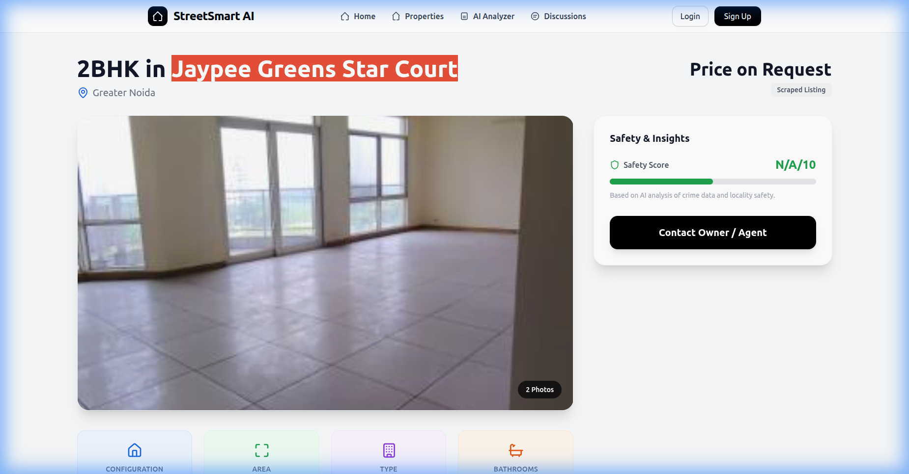

# StreetSmartAI 🏘️🤖

**StreetSmartAI** is an advanced real estate analysis platform designed to empower property buyers and renters with deep, AI-driven insights. By combining data scraping, community sentiment analysis, and legal document review, StreetSmartAI provides a 360-degree view of any property.



## 🚀 Key Features

*   **🔍 Comprehensive Property Analysis**: Automatically aggregates detailed property specifications, pricing history, and amenities from major real estate portals.
*   **🗣️ Community Sentiment (Reddit Integration)**: Taps into Reddit discussions to surface real, unfiltered community opinions and "street smarts" about specific societies and localities.
*   **📄 Rental Agreement Analyzer**: Uses advanced AI (Gemini) to scan rental agreements, identifying potential risks, red flags, and summarizing key terms in plain English.
*   **🌐 Browser Extension**: A companion Chrome extension that brings StreetSmartAI's insights directly to you while you browse property listing sites.
*   **📊 Interactive Dashboard**: A modern, responsive React-based dashboard to visualize data and manage your property shortlist.

## 🛠️ Tech Stack

*   **Frontend**: React.js, Tailwind CSS
*   **Backend**: Node.js, Express.js
*   **Database**: MongoDB
*   **AI/ML**: Google Gemini API (for text analysis and sentiment)
*   **Scraping**: Python, Selenium/BeautifulSoup
*   **Tools**: Git, Docker (optional)

## 📦 Installation

1.  **Clone the repository**
    ```bash
    git clone https://github.com/Adityavidhuri10/streetSmartAi.git
    cd streetSmartAi
    ```

2.  **Install Dependencies**

    *   **Backend**:
        ```bash
        cd src/backend
        npm install
        ```
    *   **Frontend**:
        ```bash
        cd src/frontend
        npm install
        ```

3.  **Environment Setup**
    Create a `.env` file in `src/backend` and add your credentials:
    ```env
    PORT=5000
    MONGO_URI=your_mongodb_uri
    JWT_SECRET=your_jwt_secret
    GEMINI_API_KEY=your_gemini_api_key
    ```

4.  **Run the Application**

    *   Start the backend:
        ```bash
        cd src/backend
        npm run dev
        ```
    *   Start the frontend:
        ```bash
        cd src/frontend
        npm start
        ```

## 🤝 Contributing

Contributions are welcome! Please feel free to submit a Pull Request.

## 📄 License

This project is licensed under the MIT License.
